# HazardLens

**Real-time construction site safety detection powered by YOLO26 and computer vision.**

HazardLens monitors video feeds from construction sites to detect PPE compliance, hazard zone violations, near-miss incidents, and unsafe worker behavior — then surfaces actionable alerts on a live dashboard.

[**Watch the Demo**](https://github.com/Smear6uard/HazardLens/issues/4)

```
Video Input → YOLO26 Detect → PPE Classify → Zone Check → Track → Alert → Dashboard
```

## Architecture

```mermaid
graph LR
    A[Video Feed] --> B[OpenCV Decode]
    B --> C[YOLO26 Detection]
    C --> D[PPE Heuristic Classifier]
    D --> E[Shapely Zone Engine]
    E --> F[Centroid Tracker]
    F --> G[Temporal Event Detector]
    G --> H[Risk Analytics]
    H --> I[Annotated Frame]
    I --> J[SSE / WebSocket Stream]
    J --> K[React Dashboard]
```



## Features

- **PPE Detection** — Hardhat compliance via HSV color analysis on YOLO-detected person crops
- **Hazard Zones** — Draw polygonal restricted/hazard zones, get alerts on entry/exit and loitering
- **Near-Miss Detection** — Proximity tracking between workers and vehicles with cooldown logic
- **Fallen Worker Detection** — Aspect ratio inversion over consecutive frames triggers critical alert
- **Live Risk Score** — Weighted composite (PPE 40%, zones 25%, near-miss 25%, density 10%)
- **Demo Mode** — Pre-computed 500-frame narrative with synthetic CV frames — no GPU required
- **Webcam Support** — Real-time WebSocket processing for live camera feeds
- **Video Upload** — SSE-streamed processing of uploaded video files

## Quick Start

### Docker (Recommended)

```bash
docker compose up --build
```

- **Frontend**: http://localhost:3000
- **Backend API**: http://localhost:8000
- **API Docs**: http://localhost:8000/docs

### Manual Setup

```bash
# Backend
cd backend
python3 -m venv venv && source venv/bin/activate
pip install -r requirements.txt
mkdir -p uploads
uvicorn main:app --reload --port 8000

# Frontend (new terminal)
cd frontend
npm install
npm run dev
```

Or use the convenience script:

```bash
./start.sh
```

## How It Works

### Detection Pipeline

1. **Frame Decode** — OpenCV reads video frames, skipping every Nth frame for performance
2. **YOLO Detection** — YOLO26n identifies persons, vehicles, and equipment in each frame
3. **PPE Classification** — Upper 30% of each person bounding box is cropped, converted to HSV, and analyzed for hardhat colors (yellow, orange, white, red) via histogram thresholding
4. **Zone Checking** — Shapely polygons test whether worker centroids fall within defined hazard/restricted zones
5. **Object Tracking** — Centroid-based tracker maintains identity across frames using scipy distance matrices
6. **Event Detection** — Stateful temporal logic detects PPE transitions, zone entries/exits, loitering, near-misses, and fallen workers
7. **Risk Analytics** — Composite risk score aggregated from violation rates, updated per-frame
8. **Annotation** — Semi-transparent zone overlays, color-coded bounding boxes, trajectory trails, and label backgrounds rendered with OpenCV
9. **Streaming** — Annotated frames + event data pushed to frontend via SSE (uploads) or WebSocket (webcam)

### PPE Heuristic

The hardhat detector uses HSV color-space analysis rather than a dedicated PPE model. This is designed as a **swappable interface** — the `DetectorInterface` ABC means a fine-tuned PPE model drops in with zero pipeline changes.

| Color   | Hue Range | Saturation | Brightness |
|---------|-----------|------------|------------|
| Yellow  | 20-35     | >80        | >80        |
| Orange  | 10-20     | >80        | >80        |
| White   | any       | <30        | >200       |
| Red     | 0-10, 170-180 | >80    | >80        |

### Demo Mode

Demo mode serves a pre-computed 500-frame narrative arc with synthetic OpenCV-rendered frames:

| Frames    | Scenario                        | Risk Level |
|-----------|---------------------------------|------------|
| 0-100     | 4 workers, all compliant        | Low        |
| 100-200   | Worker removes hardhat          | Medium     |
| 200-300   | Vehicle enters restricted zone  | High       |
| 300-400   | Near-miss incident              | Critical   |
| 400-500   | Compliance restored             | Low        |

No YOLO model or GPU needed — works on any machine.

## API Endpoints

| Method | Path | Description |
|--------|------|-------------|
| POST | `/api/upload` | Upload video for processing |
| GET | `/api/jobs/{id}/status` | Job progress |
| GET | `/api/jobs/{id}/stream` | SSE frame + alert stream |
| GET | `/api/jobs/{id}/analytics` | Aggregated analytics |
| GET | `/api/jobs/{id}/events` | Event list with filters |
| POST | `/api/zones` | Create hazard zone |
| GET | `/api/zones` | List all zones |
| DELETE | `/api/zones/{id}` | Remove zone |
| PUT | `/api/settings` | Update pipeline config |
| WS | `/ws/live` | Webcam real-time processing |
| GET | `/api/demo/stream` | Demo SSE stream |
| GET | `/api/demo/analytics` | Demo analytics |
| GET | `/api/demo/events` | Demo events |
| GET | `/api/health` | Model + system status |

## Tech Stack

| Layer | Technology |
|-------|-----------|
| Detection | YOLO26 via Ultralytics, OpenCV |
| Backend | Python 3.11, FastAPI, aiosqlite |
| Tracking | scipy, Shapely |
| Frontend | React 18, Vite, Tailwind CSS |
| Charts | Recharts |
| Streaming | SSE (sse-starlette), WebSocket |
| Deploy | Docker Compose |

## Performance

| Metric | Value |
|--------|-------|
| Detection FPS (CPU) | 10-15 fps with frame skip |
| Detection FPS (GPU) | 25-30 fps |
| Tracking latency | <2ms per frame |
| Zone check latency | <1ms per frame |
| SSE stream overhead | ~5ms per frame |
| Demo mode | 60+ fps (pre-computed) |

## Roadmap

- [ ] Fine-tuned PPE detection model (hardhat, vest, gloves, goggles)
- [ ] Multi-camera support with unified dashboard
- [ ] 3D zone definition with depth estimation
- [ ] NVIDIA Jetson edge deployment
- [ ] Integration with Procore / Autodesk BIM 360
- [ ] Slack/Teams webhook alerting
- [ ] Historical trend analysis and shift reports
- [ ] OSHA compliance report generation

## License

MIT
